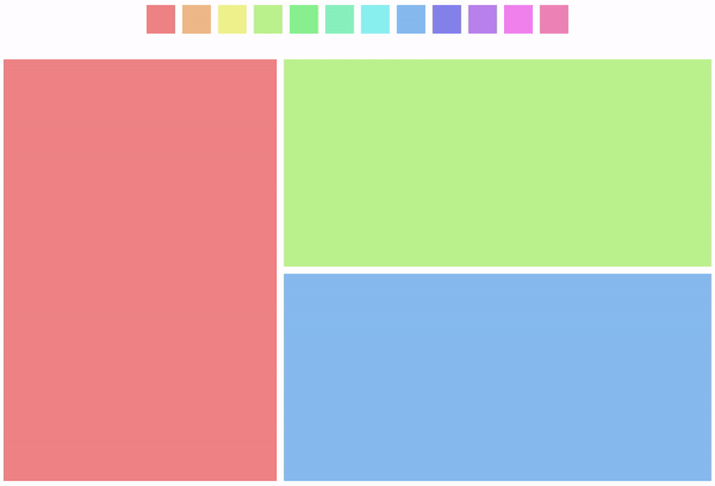

# dirk

> A simple dashboard layout library powered by Vue, written at [SamKnows].



You can find a demo of this here: https://samknows.github.io/dirk/

## Installation

```
$ npm install --save dirk
```

## Usage

To use Dirk, you need to import the `Dashboard` component, and then pass in a configuration object containing information on what to display in the dashboard and how to display it.

Have a play with [the demo][demo dashboard].

Each coloured block is a *panel*. Every panel is powered by a Vue component. For example:
 
```vue
<template>
  <dashboard :data="data" :component-getter="getComponent" :editing="true"></dashboard>
</template>

<script>
  import Dashboard from 'dirk';
  import MyTestPanel from './MyTestPanel.vue';
  
  export default {
    data: () => ({
      data: {
        type: 'horizontal',
        size: 1,
        children: [
          {
            type: 'panel',
            size: 1,
            component: 'MyTestPanel'
          }
        ]
      }
    }),
    methods: {
      getComponent(name) {
        if (name === 'MyTestPanel') {
          return MyTestPanel;
        }

        return { render: h => h('p', '404 component not found') };
      }
    },
    components: {
      Dashboard,
    }
  };
</script>
```

The would display the MyTestPanel component as the entire dashboard. There's two parts to this, the data object, and the getComponent method. The data object contains *blocks*, which can be a panel (a component), or "vertical" or "horizontal", which is a layout block which can contain multiple blocks laid out—you guessed it—either vertically or horizontally. The getComponent method takes the string stored in the configuration and returns an actual Vue component: the reason you can't specify a Vue component directly in the configuration is that it makes the object a lot trickier to store in a database.

In the previous example, we simple have a horizontal block containing a panel block. We can't have a panel block as the root block or the library won't know what to do when we add a new block. The `size` attribute says how much of the space a block should take up. For example, the following configuration would display two panels - the first taking 40% of the width, and the second taking 60% of the width.

```js
const data = {
  type: 'horizontal',
  size: 1,
  children: [
    {
      type: 'panel',
      size: 0.4,
      component: 'MyTestPanel'
    },
    {
      type: 'panel',
      size: 0.6,
      component: 'MyOtherTestPanel'
    }
  ]
};
```

It's also possible to pass in *configuration*, using the `meta` attribute:

```js
const data = {
  type: 'horizontal',
  size: 1,
  children: [
    {
      type: 'panel',
      size: 0.4,
      component: 'MyTestPanel',
      meta: {
        color: 'red'
      }
    },
    {
      type: 'panel',
      size: 0.6,
      component: 'MyOtherTestPanel',
      meta: {
        color: 'blue'
      }
    }
  ]
};
```

The contents of the meta object will be passed into the component as props—effectively, `<MyTestPanel color="red" />`. Basically this exact behaviour can be seen in [the demo dashboard][demo dashboard].

In addition to passing in panel blocks to the horizontal and vertical blocks, you can put other horizontal or vertical blocks inside each other to created *nested blocks*. The following displays one block on the left of the screen with two horizontally stacked blocks to the right of that block: the default settings for the demo dashboard.

```js
const defaultData = {
  type: 'horizontal',
  size: 1,
  children: [
    {
      type: 'panel',
      size: 0.4,
      component: 'MyTestPanel'
    },
    {
      type: 'vertical',
      size: 0.6,
      children: [
        {
          type: 'panel',
          size: 0.5,
          component: 'MyTestPanel'
        },
        {
          type: 'panel',
          size: 0.5,
          component: 'MyTestPanel'
        }
      ]
    }
  ]
};
```


### Editing the dashboard

So far we've just covered how you can display dashboards to the user, but the dashboards are user editable as well. It uses the HTML5 drag and drop API, so it's supported in nearly all desktop browsers including IE11.

The `Dashboard` component has an `editing` property: just set it to true and the dashboard will be user editable:

```vue
<dashboard :data="data" :component-getter="getComponent" :editing="true"></dashboard>
```

Now, the user is able to drag panels into different places, add new panels and delete existing panels.

When something is being dragged, the `dataTransfer` property of the event is set to a JSON stringified version of a component object with `component` and `meta` properties.

You can create an element which will *create a new panel* when dragged onto the dashboard like this:

```vue
<template>
  <div @dragstart="handleDragstart" draggable="true">
    Drag me!
  </div>
</template>

<script>
  export default {
    methods: {
      handleDragstart(e) {
        const data = {
          component: 'MyTestPanel',
          meta: {
            color: 'red'
          }
        };
        e.dataTransfer.setData('text', JSON.stringify(data));
      }
    }
  };
</script>
```

Then when it is dragged onto the dashboard the `MyTestPanel` component will be added. It can either be dragged onto the side of a panel to create a new panel next to it, or onto an existing panel to replace that panel.


### Saving dashboard layout

The dashboard modifies the original object passed to it (I know, I know), so you can just store it in a database or in localStorage or something and pass it straight back in to the dashboard next time the users accesses it.

Let's add an Edit/Save button to our first example that saves to and loads from localStorage:

```vue
<template>
  <dashboard :data="dashboardData" :component-getter="getComponent" :editing="editing"></dashboard>
  <button @click.prevent="handleButtonClick">{{ editing ? 'Save' : 'Edit' }}</button>
</template>

<script>
  import Dashboard from 'dirk';
  import MyTestPanel from './MyTestPanel.vue';
  
  const storedData = localStorage.getItem('dirk-data');
  
  const defaultData = {
    type: 'horizontal',
    size: 1,
    children: [
      {
        type: 'panel',
        size: 1,
        component: 'MyTestPanel'
      }
    ]
  };
  
  export default {
    data: () => ({
      dashboardData: storedData ? JSON.parse(storedData) : defaultData,
      editing: false
    }),
    methods: {
      getComponent(name) {
        if (name === 'MyTestPanel') {
          return MyTestPanel;
        }

        return { render: h => h('p', '404 component not found') };
      },
      handleButtonClick() {
        if (this.editing) {
          localStorage.setItem('dirk-data', JSON.stringify(this.dashboardData));
        }
        
        this.editing = !this.editing;
      }
    },
    components: {
      Dashboard,
    }
  };
</script>
```

Now the first time the dashboard is loaded, it will load from the default data, and when the user makes a change to the dashboard and saves it, the new dashboard will be stored in localStorage and loaded instead of the default data the new time the user accesses the page.


### Events

The dashboard component also emits two events: `changed` and `changing`.

- The `changed` event is triggered when anything about the dashboard changes: when the users adds, removes, or changes a panel, or when the user changes the size of a panel.
- The `changing` event event is emitted when the user is currently dragging the side of a panel to resize it. This event is useful for handling the aspect ratio of a component - but be careful not to do anything too heavy here or the resize will feel jerky.


## Browser support

Dirk is tested in all modern desktop browsers, all the way down to IE11. We're using it on our production website and shipping it to clients who use IE, so it should be pretty stable.

Mobile support isn't as good: while everything displays, no android browsers and only the latest iOS browser have support for the drag and drop API at the time of writing, so you can't really enable editing on mobile.


## License

Dirk is released by [SamKnows] under the MIT license.


[SamKnows]: https://samknows.com/
[demo dashboard]: https://samknows.github.io/dirk/
